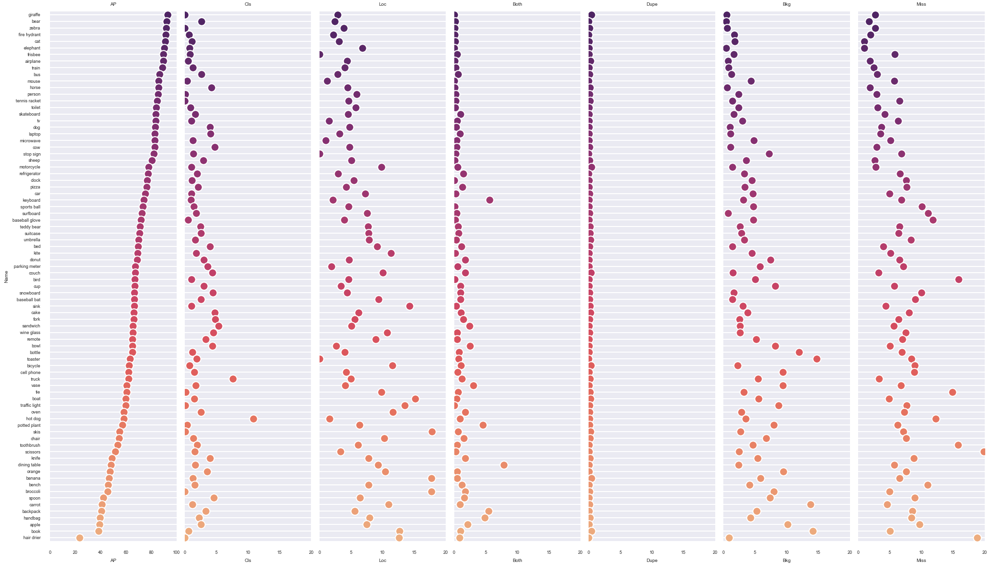
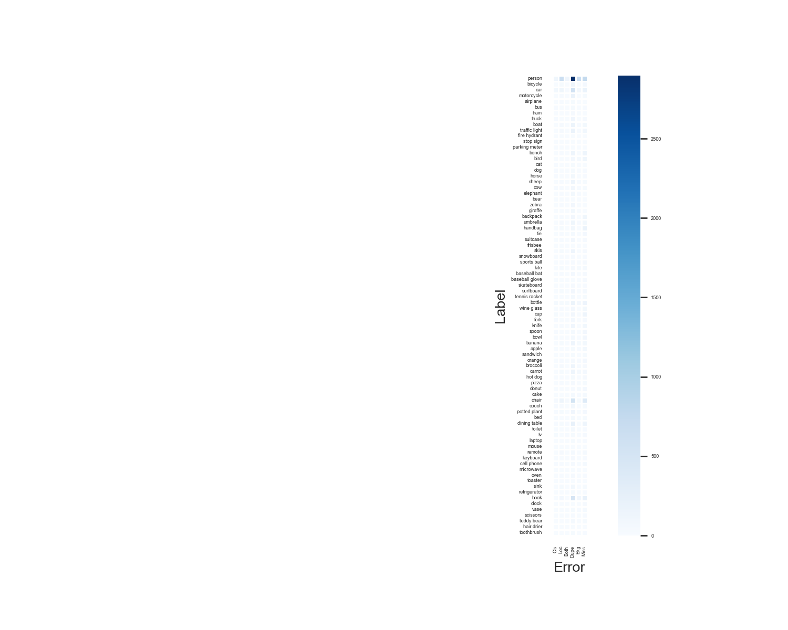

# Nobunaga: Object Detection Analyzer
Nobunaga is an Object Detection Analysis tool in Computer Vision.
Based on [TIDE](https://www.ecva.net/papers/eccv_2020/papers_ECCV/papers/123480562.pdf), which is one of the excellent error analysis algorithms,
Nobunaga exports the overall distribution of detection error in the given dataset as well as per-category error.
Towards analyzing miss classification, Nobunaga plots their error in a confusion matrix.
Moreover, it plots detection errors in images one by one with annotation.
We hope it could be beneficial for you to figure out what kind of detection error happens in your models specifically.

## Installation
```shell
    pip install git+https://github.com/FastAccounting/nobunaga
```

### Analize error
Before analyzing detection error, 
you need to prepare ground truth formated in [COCO object dtection](https://cocodataset.org/#home) and its corresponding prediction results in JSON and image dataset.

Command line is as follows:
```bash
  python3 show_coco_errors.py \
    --pred coco_instances_results.json \
    --gt instances_val.json \
    --image_dir path/to/image_dir \
    --iou_threshold 0.5 \
    --confidence_threshold 0.7
```

Then, you can get the below files
- error distribution
- class error matrix
- error files with error label


#### Per-label detection error


#### Confusion matrix
The confusion matrix visualizes what label tends to be misclassified as other labels.
We remark that this confusion matrix visualizes only false examples, so correct ones are omitted.



#### Detection error plot


