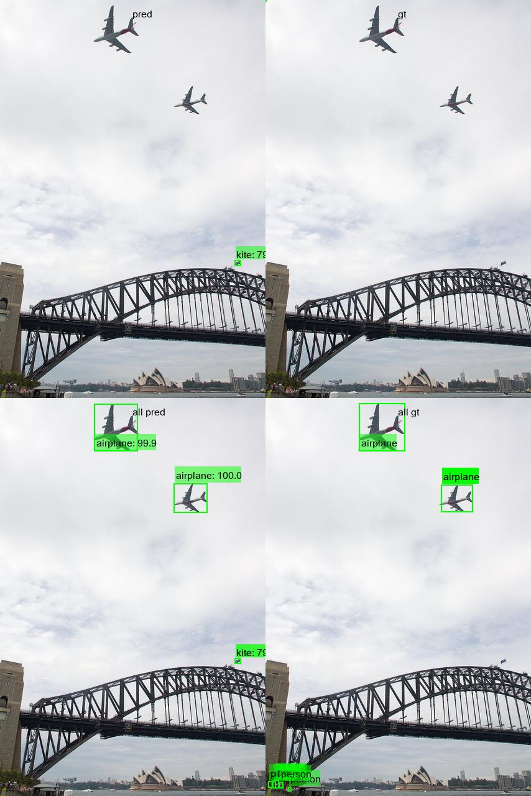
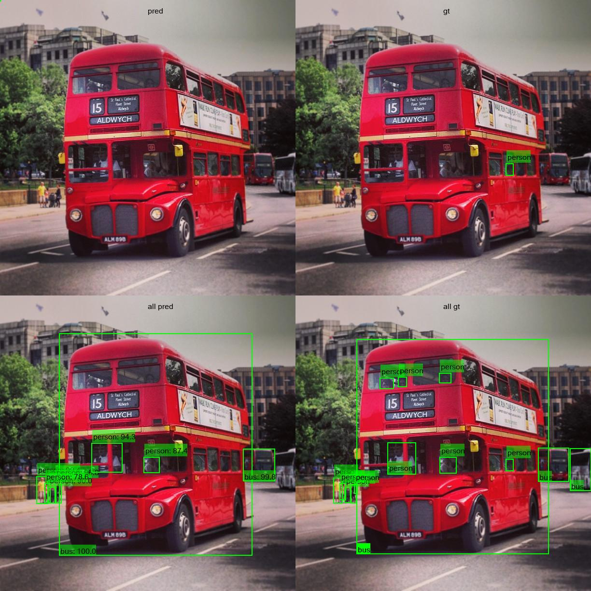

# Nobunaga
Nobunaga is a Object Detection Analysis tool in Computer Vision.
Based on [TIDE](https://www.ecva.net/papers/eccv_2020/papers_ECCV/papers/123480562.pdf), which is one of the great error analysis algorithm,
Nobunaga exports the overall distribution of detection error in the given dataset as well as per-category error.
Towards analying miss classification, Nobunaga plots their error in aconfusion matrix.
Moreover, it plots detection error in images one by one with annotation.
We hope it could be beneficial for you to figure out what kind of detection error happends in your models specifically.

## Installation
```shell
    pip install git+https://github.com/FastAccounting/nobunaga
```

## Usage
The error analysis tool TIDE has been extended to output errors in each category.
See `show_errors.py` to use the tool.
In addition to the typical TIDE results, each class's confusion matrix and error analysis are output.

### Analize error
Before analizing detection error, 
you need to prepare ground truth formated in [COCO object dtection](https://cocodataset.org/#home), its corresponding prediction results in JSON and image dataset.

Command line is as follows:
```bash
  python3 show_coco_errors.py \
    --pred coco_instances_results.json \
    --gt instances_val.json \
    --image_dir path/to/image_dir \
    --iou_threshold 0.5 \
    --confidence_threshold 0.7
```

Then, you can get below files
- error distribution
- class error matrix
- error files with error label


#### Per-label detection error


#### Confusion matrix
Confusion matrix visualizes what label tends to be misclassified as other labels.
We remark that this confusion matrix visualize only false examples, so correct ones are not included.


#### Detection error plot


