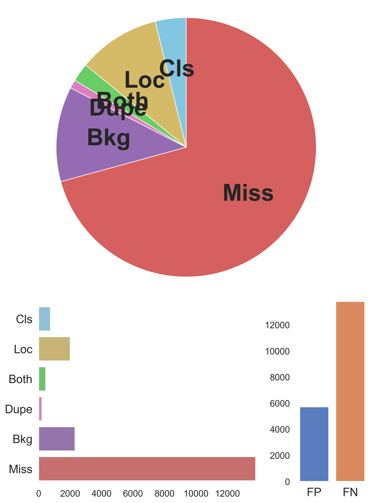

# Nobunaga: Object Detection Analyzer
Nobunaga is an Object Detection Analysis tool in Computer Vision.
Based on [TIDE](https://www.ecva.net/papers/eccv_2020/papers_ECCV/papers/123480562.pdf), which is one of the excellent error analysis algorithms,
Nobunaga exports the overall distribution of detection error in the given dataset as well as per-category error.
Towards analyzing miss classification, Nobunaga plots their error in a confusion matrix.
Moreover, it plots detection errors in images one by one with annotation.

In addition, Nobunaga can calculate [Optimal Correction Cost](https://arxiv.org/abs/2203.14438) per image.
The numeral score proposed by Otani et al. indicates how much it costs to bring a prediction closer to the corresponding ground truth.
Nobunaga allows the users to see how wrong a detection was, image by image and label by label.
We hope it could be beneficial for you to figure out what kind of detection error happens in your models specifically.

## Installation
```shell
    pip install nobunaga
```

or 
```shell
    git clone https://github.com/FastAccounting/nobunaga
    cd nobunaga
    pip install -e .
```


### Analize error
Before analyzing detection error, 
you need to prepare ground truth formated in [COCO object detection](https://cocodataset.org/#home) and its corresponding prediction results in JSON and image dataset.

Command line is as follows:
```bash
  nobunaga --pred coco_instances_results.json \
    --gt instances_val.json \
    --image_dir path/to/image_dir \
    --iou_threshold 0.5 \
    --confidence_threshold 0.7 \
    --output_image
```

Then, you can get the below files
- Error summary similar to TIDE
- Per-label detection error
- Class error matrix
- Error images with ground truth label
- Error scores of each images (Optimal Correction Cost)

The definition of errors follows TIDE.
However, we remark that Nobunaga counts the number of labels for each error, unlike TIDE.
Therefore, Nobunaga displays the total number of corresponding errors that occurred in the data set. The numbers are different from those in TIDE.


#### Error Summary
The summary of errors provides an overview of errors in the dataset, similar to TIDE.




#### Per-label detection error
This section delves into the Error Summary and shows which errors occur for each label in a figure.
The further to the right, the higher the number of errors.
For example, we confirm that the "Person" label has many Dupe errors, followed by Loc, Bkg, and Miss.


#### Class error confusion matrix
The confusion matrix visualizes what label tends to be misclassified as other labels.
We remark that this confusion matrix visualizes only false examples, so correct ones are omitted.


#### Error images with ground truth label

Images containing detection errors are written to the `{model_name}_error` directory for each error.
The pictures show one with the error on the left and another with the ground truth on the right.
Two examples are shown here.
The first image is an example of a Bkg error, which incorrectly detects the background area. The correct image has no annotations.
The second image is an example of a Miss error, indicating that a detection error has been occured.


### Explanation of each Errors

#### Classification Error (Cls)
localized correctly but classified incorrectly.
max(IoU) ≥ tf for GT of the incorrect class.

#### Location Error (Loc)
Detected by small bounding box below IoU threshold.
Classified correctly but localized incorrectly.
tb ≤ max(IoU) ≤ tf for GT of the correct class 

#### Both Error (Both)
Classified incorrectly and localized incorrectly.
tb ≤ max(IoU) ≤ tf for GT of the incorrect class

#### Duplicate Error (Dupe)
It would be correct if not for a higher scoring detection.
max(IoU) ≥ tf for GT of the correct class but another higher-scoring detection already matched that GT

#### Background Error (Bkg)
Detected background as foreground. 
max(IoU) ≤ tb for all GT. 

#### Miss Error (Miss)
All undetected ground truths (false negatives) are not already covered by classification or localization error.
In Nobunaga, "not already covered by all other errors" define as Miss Error, and more labels tend to be explained as Miss Error more than other errors.
